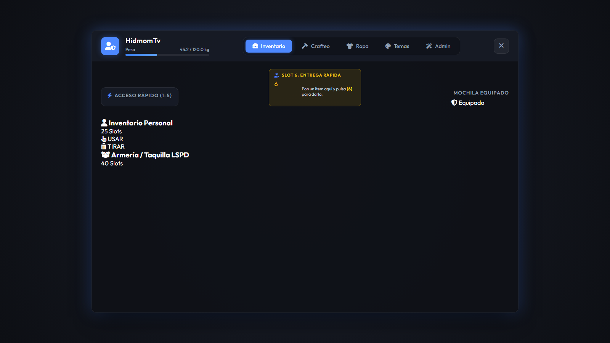
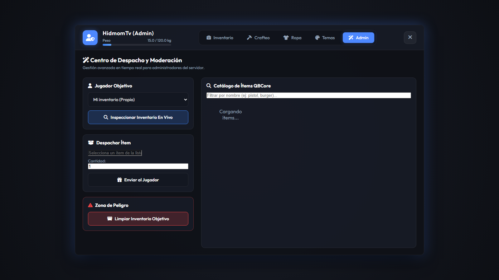

# 🎒 qb-inventory — Rework by HidmomTv

<p align="center">
  
  
  
  
  
</p>

> **Este proyecto es un fork y rework completo del [`qb-inventory`](https://github.com/qbcore-framework/qb-inventory) original de [QBCore Framework](https://github.com/qbcore-framework).**  
> Todo el crédito de la base original pertenece al equipo de QBCore. Este fork añade una interfaz visual completamente nueva (HTML/CSS/JS) y amplía la lógica de servidor con nuevas funcionalidades.
>
> Rework y mantenimiento por **[HidmomTv](https://github.com/HidmomTv)**.

---

## 📸 Capturas de Pantalla (Interfaz Real en Juego)

<p align="center">
  
</p>
<p align="center"><em>🌟 Interfaz principal con soporte para Hotbar, Entrega Rápida (Slot 6), Mochila equipada y Almacenes en tiempo real.</em></p>

<br />

<p align="center">
  
</p>
<p align="center"><em>🛡️ Panel de Despacho y Administración en vivo (/inventoryadmin) integrado directamente dentro de la interfaz.</em></p>

---

## 🔀 ¿Qué cambia respecto al original?

| Característica | qb-inventory original | Este fork |
|---|---|---|
| Interfaz | NUI básica | HTML/CSS/JS completamente personalizada |
| Temas visuales | No | Sí — temas de color en tiempo real |
| Drag & Drop | Sí | Sí — reescrito y mejorado |
| Maleteros/Guanteras | Sí | Sí — con carga lazy desde DB |
| Tiendas (shops) | Sí | Sí — compatibilidad con `RegisteredShops` y `Shops` |
| Panel de admin | No | Sí — `/inventoryadmin` con UI visual |
| Hotbar | No | Sí — slots 1–5 con atajos de teclado |
| Sistema de ropa | No | Sí — panel lateral de equipación |
| `SyncPlayerUI` export | No | Sí — actualización en tiempo real tras cualquier operación |
| Recetas de crafting | No | Sí — sistema básico extensible |

---

## ✨ Características incluidas

- **Inventario visual moderno** — interfaz HTML/CSS/JS personalizable con temas de color
- **Drag & drop** — mueve ítems entre slots arrastrando con el ratón
- **Inventarios secundarios** — maleteros, guanteras y stashes con persistencia en base de datos
- **Tiendas** — soporte completo para compra de ítems vía NUI
- **Menú de admin** — panel visual para dar ítems a jugadores (`/inventoryadmin`, `/giveitem`)
- **Sistema de ropa** — panel lateral para equipar/quitar ropa al personaje
- **Crafting** — recetas básicas de fabricación extensibles
- **Hotbar** — barra de acceso rápido (slots 1–5) con atajos de teclado
- **Sistema de armas** — inspección y gestión de armas dentro del inventario
- **Drops al suelo** — al morir o tirar ítems, aparecen como bolsas recogibles
- **Sincronización en tiempo real** — el inventario se actualiza al instante tras cada operación

---

## 📋 Requisitos

| Dependencia | Versión mínima |
|-------------|----------------|
| [QBCore Framework](https://github.com/qbcore-framework/qb-core) | Latest |
| [oxmysql](https://github.com/overextended/oxmysql) | Latest |
| FiveM Server | Artifact 6683+ |

---

## 🛠️ Instalación

### 1. Clona el repositorio
```bash
cd resources/[qb]/
git clone https://github.com/HidmomTv/qb-inventory.git
```

### 2. Importa la base de datos
```bash
mysql -u root -p tu_base_de_datos < qb-inventory.sql
```
O usa `install.sql` si es instalación nueva.

### 3. Activa el recurso en `server.cfg`
```
ensure qb-inventory
```

---

## ⚙️ Configuración

Edita `config/config.lua`:
- `Config.MaxWeight` — peso máximo del inventario del jugador
- `Config.MaxSlots` — número de slots de la mochila
- `Config.StashSize` — tamaño de los stashes
- `Config.TrunkWeights` — pesos de maleteros según clase de vehículo

---

## 🔑 Permisos de Admin

Comandos de admin disponibles para los grupos: `admin`, `god`, `command`, `mod` o Ace `command`.

| Comando | Descripción |
|---------|-------------|
| `/giveitem [id] [item] [cantidad]` | Da un ítem a un jugador |
| `/clearinv [id]` | Limpia el inventario de un jugador |
| `/inventoryadmin` | Abre el panel visual de administración |

---

## 🚗 Exports disponibles

```lua
-- Abrir contenedores desde otro recurso
exports['qb-inventory']:OpenTrunk(source, plate)
exports['qb-inventory']:OpenGlovebox(source, plate)
exports['qb-inventory']:OpenStash(source, stashId)
exports['qb-inventory']:OpenShop(source, shopName)

-- Registrar una tienda
exports['qb-inventory']:CreateShop({
    name  = "mi_tienda",
    label = "Tienda General",
    items = {
        { name = "water", price = 50, amount = 99 },
        { name = "bread", price = 30, amount = 99 },
    }
})

-- Sincronizar UI de un jugador
exports['qb-inventory']:SyncPlayerUI(source)

-- Comprobar si el jugador tiene un ítem
exports['qb-inventory']:HasItem(source, "water", 1)
```

---

## 📁 Estructura del proyecto

```
qb-inventory/
├── client/
│   ├── main.lua          # Lógica principal cliente (NUI, eventos, teclado)
│   ├── drops.lua         # Interacción con bolsas de ítems tirados en el suelo
│   ├── vehicles.lua      # Apertura de maleteros y guanteras
│   ├── clothing.lua      # Gestión del menú de ropa
│   ├── loot.lua          # Sistema de búsqueda en contenedores/basura
│   ├── rob.lua           # Robos entre jugadores
│   ├── crafting.lua      # Crafting client-side
│   ├── weapons.lua       # Gestión de armas y accesorios
│   └── hotbar.lua        # Barra de acceso rápido
├── server/
│   ├── main.lua          # Lógica principal servidor e inventarios
│   ├── items.lua         # Carga de ítems de QBCore
│   └── commands.lua      # Comandos de administración
├── html/
│   ├── index.html        # Estructura HTML de la interfaz NUI
│   ├── style.css         # Estilos con temas de color
│   ├── app.js            # Lógica JS (drag&drop, NUI callbacks)
│   └── images/           # Imágenes de ítems
├── config/
│   ├── config.lua        # Configuración principal del recurso
│   └── vehicles.lua      # Configuración de capacidades de maleteros y motores
├── locales/              # Traducciones en/es
├── install.sql           # SQL inicial para tablas
├── fxmanifest.lua
└── README.md
```

---

## 🤝 Contribuir

¡Las contribuciones son bienvenidas! Este es un fork comunitario — cuantas más manos mejor.

1. **Fork** este repositorio
2. Crea una rama: `git checkout -b feat/mi-mejora`
3. Commitea: `git commit -m "feat: descripción del cambio"`
4. Push: `git push origin feat/mi-mejora`
5. Abre un **Pull Request**

Lee la [guía completa de contribución](.github/contributing.md).

### Reportar bugs
Abre un [Issue](https://github.com/HidmomTv/qb-inventory/issues) con descripción, pasos para reproducirlo y versiones de FiveM/QBCore.

---

## ❤️ Créditos

| Rol | Autor |
|-----|-------|
| **Proyecto original** | [QBCore Framework](https://github.com/qbcore-framework/qb-inventory) |
| **Rework y mantenimiento** | [HidmomTv](https://github.com/HidmomTv) |

Este fork respeta y mantiene la licencia GPL-3.0 del proyecto original.

---

## 📄 Licencia

Distribuido bajo la licencia [GPL-3.0](LICENSE), heredada del proyecto original de QBCore.  
Puedes usar, modificar y redistribuir **siempre que mantengas la misma licencia y los créditos originales**.

---

<p align="center">
  Fork de <a href="https://github.com/qbcore-framework/qb-inventory">qb-inventory (QBCore)</a> •
  Rework por <a href="https://github.com/HidmomTv">HidmomTv</a>
</p>
